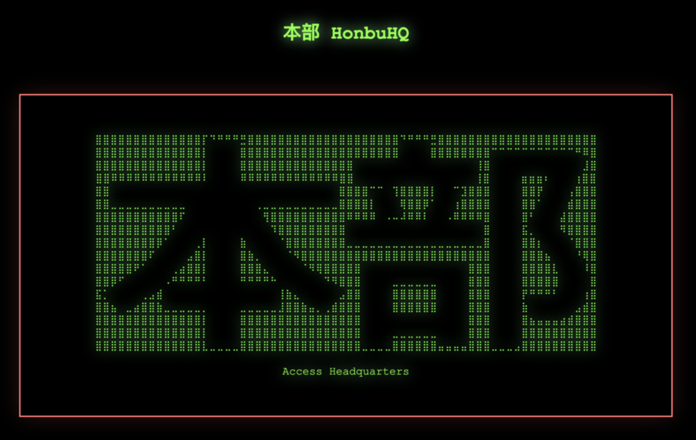
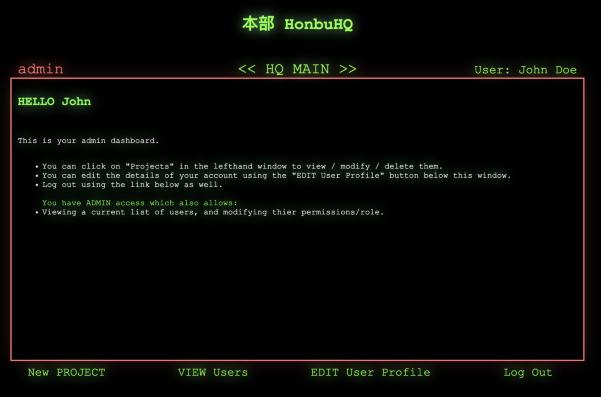
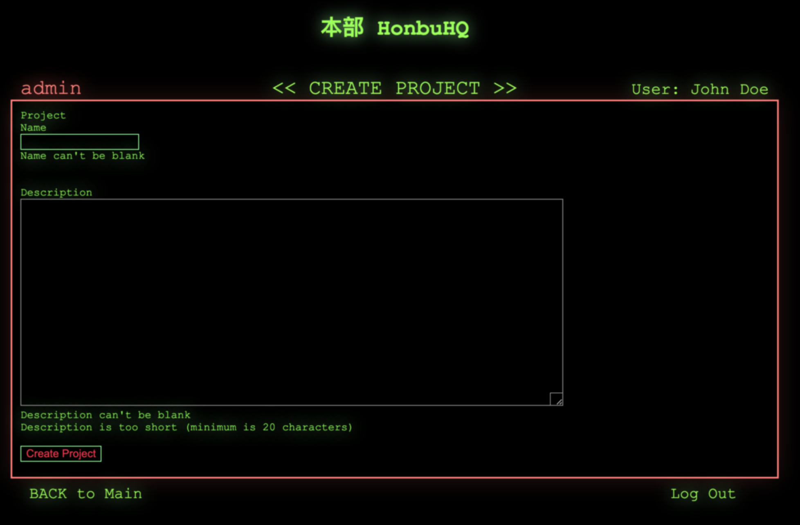
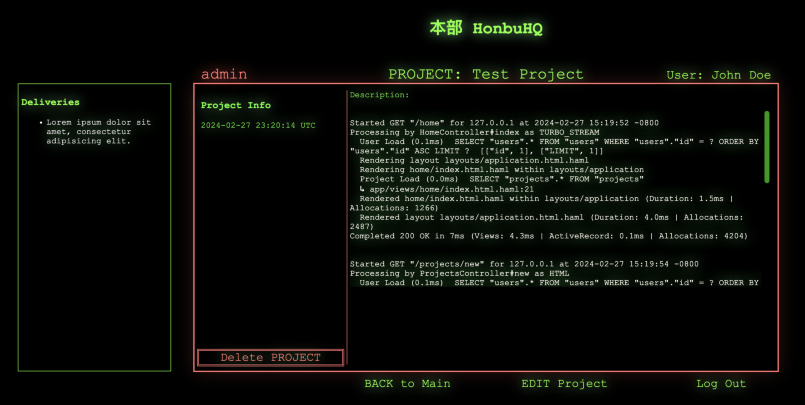
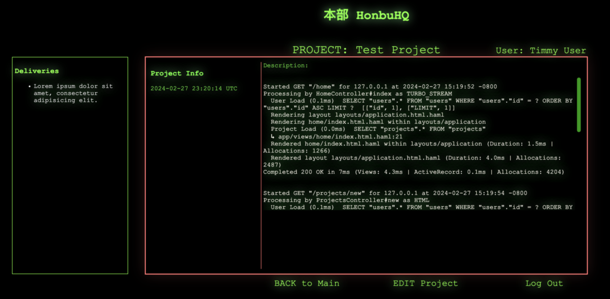
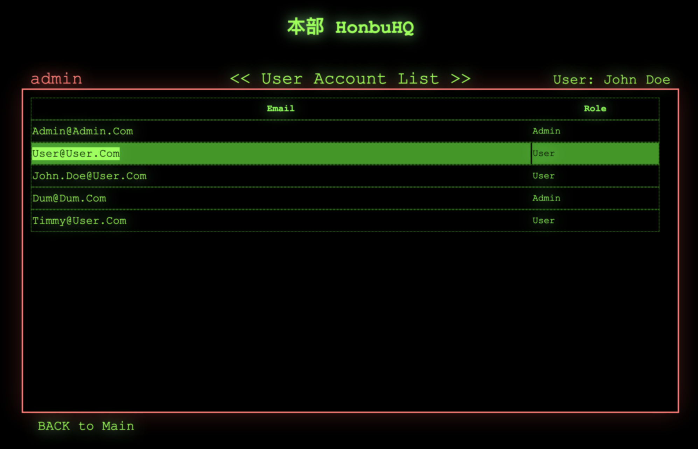
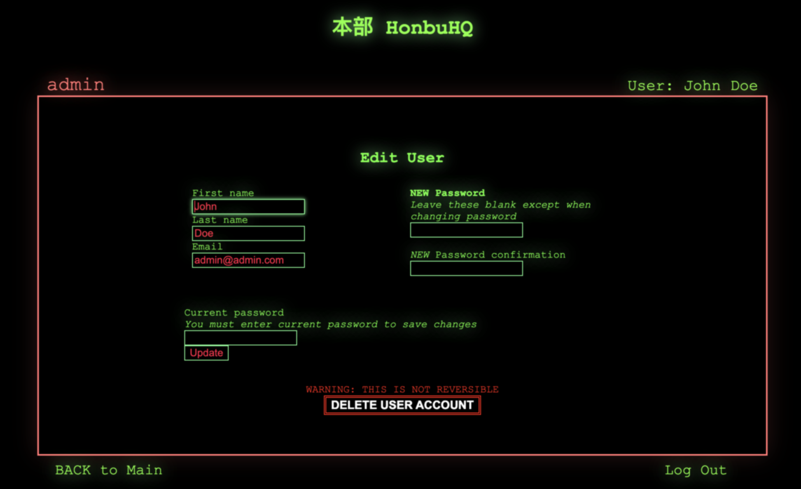

# Welcome to HonbuHQ 0.1.1
本部 "Hon-bu" is the Japanese term for headquarters.

HonbuHQ is a retro-minimalist project/task tracking application for small teams built with Ruby on Rails.

More powerful than a ToDo list but simpler and lighter than a full project managemenet application, HonbuHQ is a headquarters for your collaborative projects and tasks.

## Task
This project was created as part of the Qwasar SV - Fullstack Development Track curriculum. Fundamentally, the task is to build a rails app that recreates some of the original features of 37Signals' (creators of RoR) Basecamp webapp.

The MVP critera, defined in the assignment "my_basecamp_1", are as follows:

"We want our users to create their accounts, to connect and create projects!
As developer you need to think about the User Experience and it needs to be great."

### Assignment Parameters
- **User Registration**: User #new - User #show - User #create - User #destroy

	*In summary, you should be able to create a new user, delete a user, and as a new user, create an account yourself.*
- **Session**: User #sign_in - User #sign_out

	*Users should be able to log in and log out.*
- **Role Permission**: User setAdmin - User removeAdmin

	*This means you will have two types of permissions, someone who is a user, and someone who is a user and an admin. We want the ability to also remove the admin permission from a user.*
- **Project**: Project #new - Project #show - Project #edit - Project #destroy

	*Similar to the real Basecamp, users should be able to create, edit, and destroy a project.*

Deployment and hosting are out-of-scope for this assignment so this project is a simple build intended to run locally in the development environment to showcase the basic contstruction of a Rails app.

## Description
#### Disclaimer:
*This was my first time building with Rails and the second project I have created using Ruby. While every attempt has been made to ensure the quality of this project, many elements may not conform to best practices or may be implemented incorrectly, unsafely, or unwisely.*

### Concept:
- **Naming:** 本部 HonbuHQ

	The name HonbuHQ is a reference to the concept of a "Basecamp."
- **UX/UI Design:**

	The assignment parameters for this project constitute a minimal version of the early Basecamp application, so I chose to take these two themes (minimal + early) to thier logical terminus in the UX design.

	HonbuHQ's UX/UI is inspired by early 1980s productivity software (e.g., WordStar) and vector displays (e.g., Tektronix 4050A)
- **Features:**

	The HQWireframe.pdf file depicts the MVP concept and its features/layout - much of which will be added in forthcoming updates.

## Installation
Currently HonbuHQ is an alpha build of the app, configured only to run in the development environment using the default SQLite + Puma setup.

To Install:
1) Clone this repo to your local machine or download as a zip.
2) In a terminal window navigate to the uncompressed directory ../my_basecamp_1-dev/
3) Before using HonbuHQ you will need to setup the test database to prepare it for use. To do this you will need to run a database migration to create the tables needed for the app.

	To do this use the command:

	```rails db:migrate```

	This will generate some output like:
	```
	== 20240213185853 DeviseCreateUsers: migrating ================================
	-- create_table(:users)
	-> 0.0021s
	-- add_index(:users, :email, {:unique=>true})
	-> 0.0007s
	-- add_index(:users, :reset_password_token, {:unique=>true})
	-> 0.0006s
	== 20240213185853 DeviseCreateUsers: migrated (0.0035s) =======================

	== 20240213192421 CreateProjects: migrating ===================================
	-- create_table(:projects)
	-> 0.0014s
	== 20240213192421 CreateProjects: migrated (0.0015s) ==========================

	== 20240220191602 AddRoleToUser: migrating ====================================
	-- add_column(:users, :role, :integer, {:default=>0})
	-> 0.0020s
	== 20240220191602 AddRoleToUser: migrated (0.0021s) ===========================
	```

	If there are no errors, your database is ready to be used and you can start the rails server to begin using the app in your browser.


4) Use the rails server command (to serve app from localhost)
```rails s``` (shortcut version of ```rails server```).
You should see some output like this:
	```
	=> Booting Puma
	=> Rails 7.1.3 application starting in development
	=> Run `bin/rails server --help` for more startup options
	Puma starting in single mode...
	* Puma version: 6.4.2 (ruby 3.2.2-p53) ("The Eagle of Durango")
	*  Min threads: 5
	*  Max threads: 5
	*  Environment: development
	*          PID: 55814
	* Listening on http://127.0.0.1:3000
	* Listening on http://[::1]:3000
	Use Ctrl-C to stop
	```

5) In a web browser navigate to the "Listening on" IP address:

	```http://127.0.0.1:3000```

6) You should see the HonbuHQ start screen:

*Now you can access the HQ!*

You will need to complete the "Getting Started" steps below to have access all of the features of HonbuHQ.

### Getting Started + Setting up Admin Account

1) Clicking "Access Headquarters" will direct you to the login page.

	*Given that you will be using a fresh new database, you will need to create a new user account, as there will not be any registered users in your local database.*

2) Click on "Register New Account" to navigate to the signup page.
3) Fill out the registration form to create the new account. We will modify this account to give it Admin privilages later.

	I reccomend using easy to remember, descriptive information when making this first account (EXAMPLE):
	- first name: Test
	- last name: Admin
	- email: admin@admin.com
	- Password: ADMINadmin

	*By default all new account registrations are assigned the "USER" role/permissions. This limits what the account is permitted to see/do in the app. Giving an account Admin access is only possible through an existing Admin account, so you will have to do this process through the command line the first time.*

4) In the terminal window where you launched the rails server (and is currently displaying the server logs for the website) use the SIGINT (stop/break) command:
```Ctrl+C```
5) Launch the Rails Console using the command ```rails c``` (shortcut for ```rails console```). This will output an IRB (Interactive Ruby) prompt:
	```
	Loading development environment (Rails 7.1.3)
	irb(main):001>
	```
6) In the IRB shell use the command:

	```User.all```

	This confirms that a new user record was created. If the record was created successfully you will get something like this:
	```r
	irb(main):001> User.all
	User Load (0.1ms)  SELECT "users".* FROM "users" /* loading for pp */ LIMIT ?  [["LIMIT", 11]]
	=> [#<User id: 1, email: "admin@admin.com", first_name: "John", last_name: "Doe", created_at: "2024-02-27 20:28:25.290843000 +0000", updated_at: "2024-02-27 20:28:25.290843000 +0000", role: "user">]
	```

	This sqlite query shows a single record with user_id: 1 and role: "user"

7) To modify the user permissions, create a variable to look up this record by its id number using the command:

	```mod_user = User.find(1)```

8) Then use the .role method to modify the role to admin with this command:

	 ```mod_user.role = "admin"```

	You will see this output, showing that the new role is "admin":
	```r
	irb(main):004> mod_user.role = "admin"
	=> "admin"
	```

9) This change needs to be saved to be correctly written to the database, using this command:

	```mod_user.save```

	The console should output something like:
	```ruby
	TRANSACTION (0.0ms)  begin transaction
	User Update (0.3ms)  UPDATE "users" SET "updated_at" = ?, "role" = ? WHERE "users"."id" = ?  [["updated_at", "2024-02-27 22:53:16.318492"], ["role", 1], ["id", 2]]
	TRANSACTION (4.3ms)  commit transaction
	=> true
	```
10) To confirm this change was sucessful inspect the variable with the command: ```mod_user```, which will output the updated record:
	```r
	irb(main):005> mod_user
	=> #<User id: 1, email: "admin@admin.com", first_name: "John", last_name: "Doe", created_at: "2024-02-27 20:28:25.290843000 +0000", updated_at: "2024-02-27 20:28:25.290843000 +0000", role: "admin">
	```

11) Now you can quit the console with the command:

	```quit```

	- restart the rails server using command:

	```rails s```

	- and log in to the app with the email/password you created previously. (If you are still logged into the HonbuHQ app, click the logout button to return to the start screen.)


	After logging back in, the app will now indicate that this user has Admin privilages:


## Usage

Let's walk through the basics of using HonbuHQ to demonstrate its features!

### User Sessions
Authentication in HonbuHQ is handled with the Devise gem.
- A User Session is created upon a sucessful Login.
- Logout button will end the session and redirect to the HonbuHQ homepage
- User sessions are automatically ended after 10 minutes of inactivity on the page. When a user session is timed out in this manner, HonbuHQ will prompt the user to sign in again before completing any requested actions on the page.

### Project CRUD
- **CREATE**

	1) To create a new project click New Project in the bottom navigation bar
	2) You will be shown a form where you can enter a Name and a Description for the Project. HonbuHQ will reject the form, and display error mssgs if:
		- Either field is left blank
		- The description is less than 20 characters

	

- **READ**: After filling out the form and clicking the Create Project button you will be directed to the project viewing page for the new project you just made:

	
	*Here you can see we have filled the descripton with server log text*

- To **UPDATE**/edit the Project, click the EDIT Project button, and you will be returned to the Project form. Clicking the Update button in this form will save the Project
- **DELETE** Only an account with Admin permission can use the "DELETE PROJECT" button. Regular users do not see this option:
	
	*Deleting a Project will prompt the Admin with a browser confirmation message*

### Roles / Permissions
- Managing roles and permissions in HonbuHQ is much easier now that you have an Admin account. Rather than having to use the Rails console to update user permissions, Admins can do this from inside the app itself.

	*I reccomend signing up a second account from the registration page to test this - but you will need to be logged into an Admin account to use this feature*
	1) From the HQ MAIN page - click the "VIEW Users" button
	2) This will take you to the User Account List page
	
	3) Clicking on a user email address will open the User Account editor:
		- In the User Account Editor, you can use the radio button to switch the User account role between user and admin.

		*NOTE: You need to keep at least one Admin account, or else you will have to use the console to change user roles.*

### User CRUD
- Users are **CREATED** with the registration page, handled by Devise.
- Users may be **READ** in part by the User Account List page, where thier *roles* are also **UPDATED**.
- Updating other User details and **DELETING** users is done by clicking the button in the bottom nav bar of the HQ MAIN homepage which redirects you to the Edit User page:


- Users must enter their current password to make any changes to the details on this page.
- Deleting a user prompts a confirmation window.

## Upcoming Features
There are a variety of new features planned for HonbuHQ, several of which are nearing completion and will be added in an upcoming update. These features are all displayed in the HQWireframe.pdf
1) Teams
	- Admin accounts may invite other users to a project
	- Users on a project are called a Team
	- Only Team Members may view projects
2) Threaded User comments called "Posts" for each Project
3) Project Deliverables
	- (These are todo lists with individual items called Tasks)
4) Tasks
	- Tasks are assigned to individual team members, who then have the ability to mark them complete
	- As individual tasks are completed by team members the Deliverable % completion is updated and displayed
	- User List View will show all Team members, current projects they are on, and how many outstanding/completed tasks they own.
5) File Upload and storage
	- Files may be uploaded to projects and downloaded by any User with access to that project.

### The Core Team

Christopher A. Deetz

<span><i>Made at <a href='https://qwasar.io'>Qwasar SV -- Software Engineering School</a></i></span>
